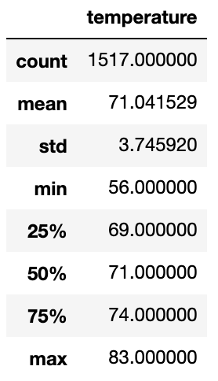

# surfs_up

## Overview
Our client is preparing a presentation on opening a surf shop in Oahu for his board of directors. In his presentation, he wants to provide them with climate analysis to be able to support the viability of the surf and ice cream store being financially sustainable year round. So, we are querying weather data for Oahu from 2010 to 2017 for its temperature recordings in June and December for our client to use in their proposal.

## Analysis
To query our database for the June temperatures of each year, we imported 'extract' from SQLAlchemy in order to specify our filter.

After transferring our data into a dataframe, we utilized Pandas' describe function to return the summary statistics on the month of June. As shown below, the average temperature was comfortably warm at 74.9 degrees. The coldest temperature recorded in June was 64.0 degrees and the warmest was 85.0 degrees. The standard deviation was 3.26 degrees with 75% of the data recorded being 73 degrees or warmer.

For our December temperature statistics, our average temperature was 71.0 degree, almost four degrees lower. The coldest temperature reached 56 degrees while the warmest was 83 degrees. The standard deviations was larger at 3.75 degrees, attributed to the higher variance of temperatures, with 75% of the data being 69 degrees or warmer.

## Summary
Given our initial weather analysis, the temperature for the months of June and December are fairly consistent, although December was shown to experience significantly lower temperatures on its coldest days. We believe this data can help to advise the board that the surf and ice cream store would be viable as a year round venture in Oahu given the similar average temperatures, and that about 75% of the recordings for each month being at or above 70 degrees. However, we can further bolster our analysis and gain more insight by performing at least two more queries. The first query is to pull the percipitation scores for each month, as that would help to determine how many days per month we can expect to be rained out. Additionally, we could perform a query on the most active weather recording station to possibly shield our summary statistics against outliers. In regard to gathering more data, we suggest finding recordings of the ocean temperatures, and other weather condition recordings such as, cloud cover for these months. This would provide more insightful information of our weather analysis and help to better predict possible consumer interest in surfing in colder temperatures.
